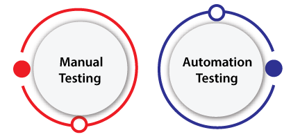

# PRUEBAS DE SOFTWARE

## 1. QUÉ SON LAS PRUEBAS DE SOFTWARE

La prueba de software es el proceso de evaluar y verificar que un producto o aplicación de software hace lo que se supone que debe hacer

Las pruebas según su ejecución se pueden clasificar en dos grupos:

- Manuales

- Automatizadas

#### 1.1 TEST MANUALES

Son los que se ejecutan manualmente por un tester.

#### 1.2. TEST AUTOMATIZADOS

Son los que se ejecutan automáticamente por un software.