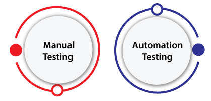

### PRUEBAS DE SOFTWARE

#### 1. TEST MANUALES

Son los que se ejecutan manualmente por un tester, que verifica que el software cumpla con los requerimientos y que no tenga errores.

#### 2. TEST AUTOMATIZADOS

Son los que se ejecutan automáticamente por un software, que verifica que el software cumpla con los requerimientos y que no tenga errores.