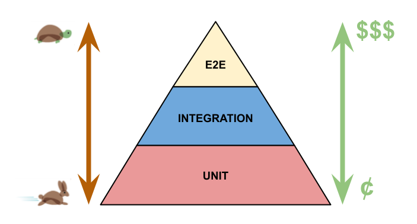

# PRUEBAS DE SOFTWARES

## 2. TIPOS DE PRUEBAS DE SOFTWARE

Las pruebas de software se pueden clasificar en diferentes tipos, según el nivel de prueba, el tipo de prueba y el esfuerzo de automatización.


### 2.1 TEST UNITARIOS: 

Se prueban las unidades de código más pequeñas posibles, como funciones o métodos.

``` csharp
[Test]
public void TestCalcularTotalFactura()
{
    // Crear un objeto de factura
    Factura factura = new Factura();

    // Añadir algunos elementos a la factura
    factura.AñadirElemento(new ElementoFactura { Precio = 10, Cantidad = 2 });

    // Calcular el total de la factura
    double total = factura.CalcularTotal();

    // Verificar que el total es correcto
    Assert.AreEqual(20, total);
}
```


### 2.2 TEST DE INTEGRACIÓN:

Se comprueba cómo diferentes partes o módulos de un sistema trabajan juntos.

Por ejemplo, puede probar cómo un módulo de autenticación funciona correctamente.

``` csharp
[Test]
public void TestAutenticacion()
{
    // Crear un objeto de autenticación
    Autenticacion auth = new Autenticacion();

    // Llamar al método de inicio de sesión
    bool resultado = auth.IniciarSesion("usuario", "contraseña");

    // Verificar que el resultado es verdadero
    Assert.IsTrue(resultado);
}

```


### 2.3 TEST END2END:

Se comprueba que un flujo de trabajo completo funcione como se espera, de princio a fin.


•	Por ejemplo, puede verificar  todo el proceso de compra de un sitio web
    
    * En la página de inicio del sitio, buscar un producto,
    * Añadirlo al carrito, proceder al pago
    * Introducir detalles de pago 
    * Finalmente confirmar la compra.


###  ESFUERZO:

El esfuerzo de automatización se refiere a la cantidad de tiempo y recursos necesarios para crear y mantener pruebas automatizadas.


