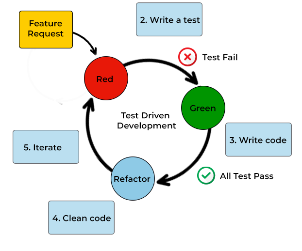

### PRUEBAS DE SOFTWARE


#### 2. METODOLOGÍAS DE TEST


##### 2.1 TDD (Test Driven Development)

Es una metodología de desarrollo de software que implica escribir primero las pruebas y luego el código. 

A menudo, las pruebas escritas en TDD son pruebas unitarias.

En TDD, el proceso generalmente sigue estos pasos:
1.	Escribe una prueba unitaria que describa una función o mejora deseada.
2.	Ejecuta la prueba, que debería fallar porque aún no has implementado la función.
3.	Escribe el código mínimo necesario para pasar la prueba.
4.	Ejecuta la prueba nuevamente. Si pasa, puedes considerar la función completa.
5.	Refactoriza el código, asegurándote de que las pruebas aún pasen después de la refactorización.

###### Ciclo de vida

<!---->


##### 2.2 BDD (Behavior Driven Development):

Similar a TDD, pero se centra en el comportamiento del sistema.

Las pruebas se escriben en un lenguaje natural.

Evita usar palabras técnicas, para que lo entiendan tanto los desarrolladores como usuarios.

Por ejemplo, en BDD, un escenario de prueba podría verse así:
``` specflow
Feature: Inicio de sesión
  Como usuario quiero poder iniciar sesión en la aplicación 

  Escenario: Inicio de sesión exitoso
    Given -> Dado que estoy en la página de inicio de sesión
    When -> Cuando ingreso mi nombre de usuario y contraseña correctos
    Then -> Entonces debería ver la página de inicio  
```

###### Pasos para realiazar test en BDD

1. Se discuten los requisitos entre desarrolladores, probadores y partes interesadas
2. Define el comportamiento en lenguaje Gherkin
3. Se implementan los test.
  
