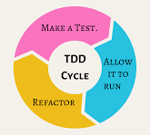

# DESARROLLO GUIADO POR PRUEBAS

## 1. QUÉ ES DESARROLLO GUIADO POR PRUEBAS

Es una metodología de desarrollo cuyo objetivo es crear primero las pruebas y luego escribir el software.


## 3. TIPOS DE METODOLOGÍAS


### 3.1 TDD (Test Driven Development)

La idea es que los requisitos sean traducidos a pruebas, de este modo, cuando las pruebas pasen se garantizará que el software cumple con los requisitos.

Para escribir las pruebas generalmente se utilizan las pruebas unitarias.

En TDD, el proceso generalmente sigue estos pasos:
1.	Escribe una prueba unitaria que describa una función o mejora deseada.
2.	Ejecuta la prueba, que debería fallar porque aún no has implementado la función.
3.	Escribe el código mínimo necesario para pasar la prueba.
4.	Ejecuta la prueba nuevamente. Si pasa, puedes considerar la función completa.
5.	Refactoriza el código, asegurándote de que las pruebas aún pasen después de la refactorización.

#### Ciclo de vida

<!---->



### 3.2 BDD (Behavior Driven Development):

Similar a TDD, pero se centra en el comportamiento del sistema.

Las pruebas se escriben en **Gherkin**, un lenguaje muy cercano al natural, evitando usar palabras muy técnicas.


Un ejemplo de una prueba BDD podría verse así:
``` specflow
Feature: Inicio de sesión
  Como usuario quiero poder iniciar sesión en la aplicación 

  Scenario: Inicio de sesión exitoso
    Given -> Dado que estoy en la página de inicio de sesión
    When -> Cuando ingreso mi nombre de usuario y contraseña correctos
    Then -> Entonces debería ver la página de inicio  
```


#### Pasos para realiazar test en BDD

1. Primero, se realiza un análisis de requisitos en el que se especifican las tareas, los objetivos y las funciones del software. 
2. Despues se describen en forma de escenarios predefinidos: (por ejemplo en lenguaje Gherkin)
3. Por último se implementan los test.
  


#### TDD vs BDD

TDD y BDD son complementarias, no alternativas.

- TDD se centra en las pruebas unitarias (bajo nivel), 

- BDD se centra en el comportamiento del sistema (alto nivel).

